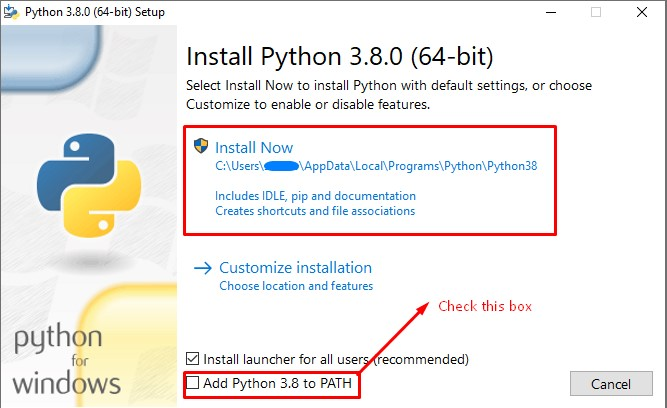
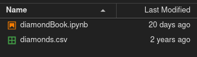
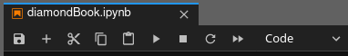
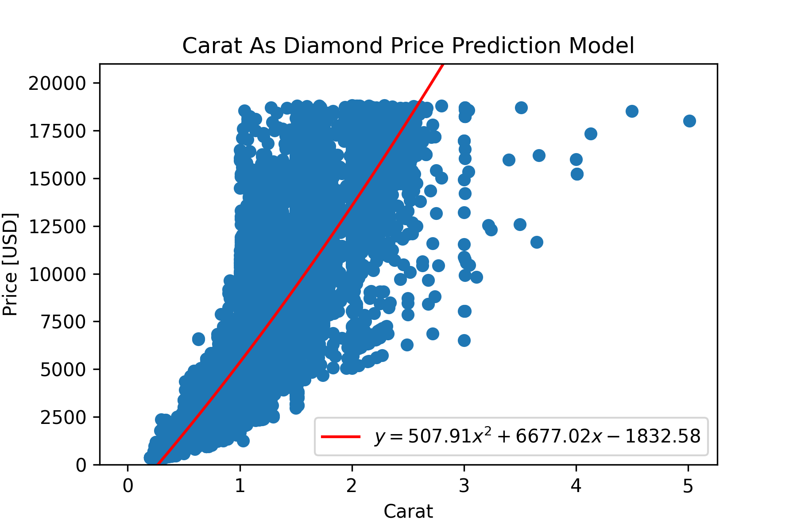

% From Experiment to Report: Dealing with Labs in Python

# Introduction and Motivation

Scientists and engineers deal with data every day in their work. Whether it be test results from an experiment or data collected in the field, they are required to process data and present their analysis in a concise, clean format. This guide seeks to provide information on best practices for handling data in a lab or experiment all the way from data  collection to the final report. To help demonstrate these techniques, some sample data will be provided and worked on at each step. If you would like to follow the code along in Jupyter Labs, here is a [link to the Jupyter Lab file](./code/diamondBook.ipynb) that I created. In addition, a PDF version can be viewed [here](./code/diamondBook.pdf). 

# Python Information

This article will use Python, a programming language created by Guido van Rossum. To get the most out of the article, it is recommended to follow along using a live version of Python. Python is a freely available programming language that can be obtained on all operating systems. Below is a list of resources to create a working install of Python on your respective operating system:

* Windows: Visit the [Python Releases for Windows](https://www.python.org/downloads/windows) page of the Python website, and download the latest Python 3 release. At the time of this being written, it is Python 3.9.2.
* macOS: Visit the [Python Releases for Mac OS X](https://www.python.org/downloads/mac-osx/) page of the Python website, and download the latest Python 3 release. At the time of this being written, it is Python 3.9.2.
* GNU/Linux: Most GNU/Linux installations come with Python installed by default. Consult the package manager installed on your distribution of GNU/Linux for more information. It should be noted that depending on the details of your distribution, cutting-edge versions of Python may not be available. Typically, this is the case on static release distributions like Debian and Ubuntu; whereas, rolling release distros such as Arch, Manjaro, and Artix Linux will have the newest version of Python. Your milage may vary here. It is not strictly necessary to have Python 3.9.2; however, I cannot guarantee that there won't be version incompatability. 

For any installation, ensure that Python is added to PATH. PATH essentially maps a global command to your command prompt. Typically, if you were to access a program via the command line, you would need to drill down to the specific folder and run the file. With a PATH-mapped application, you are able to simply call it wherever you are in your file structure. It is necessary for applications like pip, the Python package manager, and Jupyter Labs, a convenient IDE (integrated development environment).

On the graphical installers for Windows and Mac OS X, there should be a check box at the end of the installation that looks like this: 

## Python Packages

After getting the PATH variable set up properly and Python installed, it is necessary for the following packages to be installed:

* numpy: This package adds better support for arrays and mathematical operations that can occur on arrays
* matplotlib: This package adds "MATLAB style" plotting to Python. It allows for high quality figures and graphical representations of data to be made.
* pandas: This package adds support for data frames, a type of data structure built with data and statistical analysis in mind.
* jupyterlab: This package adds Jupyter Lab, a web-based IDE that is structured like a notebook. It allows for blocks of code to be run without needing to have the entire program working along in-line printing of figures. It is not a necessary package; however, the code attached at the top of the page was written as a Jupyter Notebook (the filetype Jupyter Labs uses).

Using your command line, you can install these packages by entering the following command:

```
python3 -m pip install numpy matplotlib pandas
```

If you wish to also install Jupyter Labs, the command would look like this:

```
python3 -m pip install numpy matplotlib pandas jupyterlab
```

pip is the default package manager for Python. Essentially, this tells pip to fetch those packages and install them to your Python install. Once this is done, if you elected to install the `jupyterlab` package, type the following command to open up a Jupyer Notebook:

```
jupyter lab
```

This command will open a Jupyter Lab instance wherever the working directory of your command line is. If you'd like to work out of a specific folder, it is necessary to path there before running Jupyter Lab.

With the necessary packages together, it's time to start the process of taking data from the experiment or field to the report! 

# Collecting Data

One of the most important steps in an experiment is collecting data in a format that allows the experimenter to easily access and perform analysis on the data. In the days before computer tools for data processing, this took the form of pen and paper. While this style of data acquisition is simple and requires no technical knowledge whatsoever, it is unsuited for data sets of any appreciable size. There is a reason that writing sentences over and over in school was a punishment!

With the advent of computers, gone are the days of needing to prep tables of data on paper. A CSV file, or comma separated value file, is a comma-delimited text document that is extensible across numerous programs. Spreadsheet programs such as Microsoft Excel, Google Sheets, LibreOffice Calc, and Apple Numbers are able to operate on these files while also being able to be edited from a text editor like Notepad or Vim.

# Getting the environment set up

Let's say that you're an manufacturing engineer at a large diamond company, and you want to review diamond sales information your company has to obtain some insight into your product and perform cost analysis on the plant. To show how to process data, we'll be using the ['Diamonds' dataset from Kaggle](https://www.kaggle.com/shivam2503/diamonds) that can also be obtained [here](./code/diamonds.csv). This dataset contains approximately 50,000 separate diamond entries with info including their price, carat, cut quality, and physical dimensions.

Create a folder somewhere on your hard disk that contains the previously mentioned CSV. You may also choose to place the iPython Notebook in there as well. Open a terminal (command prompt) and navigate to the folder that contains the CSV file and the notebook. Once you have done so, run `jupyter lab` to start a Jupyter Lab session. On the left, there should be a tabular view of the files in your current directory.



Open the file with the .ipynb extension. You should now be greeted by code on the right. From left to right on the following figure, the basic controls for manipulating the notebook are as follows:



* Save the file
* Create a new notebook
* Cut selected cells
* Copy selected cells
* Paste cells from the clipboard
* Run a cell
* Interrupt the Python kernel
* Restart the Python kernel and run all cells

As a rule of thumb, it is typically sufficient to run single cells at a time unless significant changes have occurred across cells. This is why using a Jupyter Lab session can be helpful in the process of creating code.

# Code Breakdown

To start with, we'll look at the first cell

```python
#Import necessary packages
import matplotlib.pyplot as plt
import numpy as np
import pandas as pd
```

The function of this cell is to call in necessary packages for the analysis. It aliases `matplotlib.pyplot` as `plt`, `numpy` as `np`, and `pandas` as `pd`. This is helpful, as in order to call these libraries, their name has to be written each time, eliminating any unnecessary keystrokes.

The second cell reads as follows:

```python
#Reading in diamond data 
diamonds = pd.read_csv("diamonds.csv")
uniqueCuts = diamonds["cut"].unique()
print(uniqueCuts)
```

This cell tells the computer to read the diamond data (labeled as `diamonds.csv` on my computer) and assign it to the variable `diamonds`. It is important that the file is in the same directory as where the Jupyter Lab instance was started; otherwise, simply inputting the name of the file as seen in the code block will not work.

After pulling the CSV file from the hard disk, the unique types of cuts are assigned as `uniqueCuts`. Say instead we wanted the unique carat values, we can replace `uniqueCuts = diamonds["cut"].unique()` with `uniqueCarat = diamonds["carat"].unique()`.

Finally, after those values are written to a variable, they are then printed. When printing the output, we receive the following result:

```
['Ideal' 'Premium' 'Good' 'Very Good' 'Fair]
```

This will be helpful later on. If we wish to characterize our data by the cut quality, we'll know which unique factors are available.

Now that we've got the raw data loaded into memory, we'll need to do some work to extract out the bits we want. The next cell shows how that can be achieved:

```python
#Cleaning data to have diamond info per cut
fair = diamonds[diamonds["cut"] == "Fair"].to_numpy()
fairP = fair[:,7]
good = diamonds[diamonds["cut"] == "Good"].to_numpy()
goodP = good[:,7]
veryg = diamonds[diamonds["cut"] == "Very Good"].to_numpy()
verygP = veryg[:,7]
prem = diamonds[diamonds["cut"] == "Premium"].to_numpy()
premP = prem[:,7]
ideal = diamonds[diamonds["cut"] == "Ideal"].to_numpy()
idealP = ideal[:,7]
```

It may seem there is a lot going on at first glance; however, when distilled to its roots, has only two main commands running on different parts of our data. Let's take this a line a time

```python
fair = diamonds[diamonds["cut"] == "Fair"].to_numpy()
```

In general, this command is telling Python to look in the `diamonds` dataframe and only take the rows of data where the `cut` column is equal to one of our factors, `"Fair"`. This then creates a dataframe that only contains information about diamonds that have a `"Fair"` value for the `"cut"` column.

```python
fairP = fair[:,7]
```
This line assigns a new variable, `fairP`, to the eigth column of the `fair` dataframe. If you are confused as to why it is the eigth column, remember that arrays are normally have 0 defined as the starting index.

If you observe the rest of the lines in the code block, you will notice the same commands are repeated but with different cut qualities. While it is possible to utilize a loop to simplify the code, it is written this way so that it is easier to see what exactly is going on without the abstraction of a loop. 

# Boxplot Generation

With the data cleaned, it is now time to use Matplotlib to start visualizing the data. Let's create a boxplot, a type of data visualization plot that visually shows how the data is spread in a set of data.

```python
#Boxplot Generation
boxData = [fairP,goodP,verygP,premP,idealP]
```

All that is happening in this block is that the data that was cleaned in the previous section is being combined into one main set of data. Later, the boxplot code will be made simpler by having our data together into one object.

```python
fig, axis = plt.subplots()
```

What is portion of the code block is doing is creating a figure object and one subplot. Essentially, a figure object describes the "frame" of a plot, and the axis object describes what is "drawn". More complex plots will manipulate these objects to create a narrowly-defined effect, but for the purposes of this article, the current setup is more than enough.

```python3
BoxPlot = axis.boxplot(boxData, patch_artist = True, showfliers = False)
fig.patch.set_alpha(1.0)
plt.xticks([1,2,3,4],["Fair","Good","Very Good","Premium","Ideal"])
plt.ylabel("Price [USD]")
plt.xlabel("Diamond Quality")
plt.title("Price Distribution of Different Diamond Qualities")
```

There's a lot in this portion of the code, so let's break it down. First, a variable `BoxPlot` is created to represent the boxplot created. It has the arguments `boxData`, `patch_artist = True`, and `showfliers = False`. Recall that `boxData` is the variable we made to group all of the cleaned data together. `patch_artist = True` allows Matplotlib to hatch each boxplot with a different color, and `showfliers = False` does as the name implies: hides any outliers beyond the whiskers.

Next, a command is called on the figure, `fig.patch.set_alpha(1.0)`. This sets the alpha level, more colloquially known as the opacity, to 1.0; thus, the figure is opaque. By default, Matplotlib will make the area beyond the plot transparent so that it may fit on backgrounds that don't match the figure color. This corrects that behavior; otherwise, viewing said plot in an image viewer may be difficult as transparent areas are rendered differently.

Finally, there are some commands that make some aesthetic changes. `xticks` is remapping the five boxplots from their numerical order to a label that is more human friendly. `1` is paired with `"Fair"`,`2` with `"Good"`, and so on. `ylabel`, `xlabel`, and `title` all change the labels seen on the y axis, x axis, and the title. They accept a string input, so they are fairly straightforward.

Next, let's color the boxplots so they stand out from one another.

```python3
colors = ['#0000FF', '#00FF00', '#FFFF00', '#FF00FF', '#FF0000']

for patch, color in zip(BoxPlot['boxes', colors):
	patch.set_facecolor(color)
```  

The first variable, `colors`, creates a list of hexadecimal color codes that are to be used for each consecutive box. A nice utility for finding hex colors can be found at [this website](https://www.color-hex.com/).

The next portion is a bit confusing, but in general, the for loop is telling Matplotlib to iterate over the number of individual boxplots in our `BoxPlot` figure and patch their face color with the provided colors.

To wrap up this boxplot, let's display and save the figure.

```python
plt.savefig('boxPlot.png', dpi = 300)
plt.show()
```

These two lines will save the figure as `boxPlot.png` at an output DPI of 300 then display the plot just created. The plot should look like this:


# Scatter Plot with Poly Fit

Now that we've got some information on the overall distribution of price per diamond quality, let's try and make a predictor of price based on carat. To do that, we'll need to first gather some data for both of these.

```python
carat = diamonds["carat"].to_numpy()
price = diamonds["price"].to_numpy()
print(carat)
print(price)
```

Like in the previous sections, we're using the `diamonds` dataframe to extract the price and carat information out of the CSV. Then, the `carat` and `price` variables are printed. Be careful if you are doing this inside of a terminal. There are a LOT of data points. The reason this is useful is that it helps give a general sense of how large the plot should be.

The next portion of code is exactly the same as the alpha change and figure/subplot as described in the boxplot generation portion.

Let's assume that a diamond's price could be modeled by the square of the carat. As an equation, we would have

$$
f(x) = \beta_1 x^2 + \beta_2 x + \beta_0
$$

where $f(x)$ represents the price of the diamond, $x$ being the carat of the diamond, and $\beta_x$ being the constant each term is multiplied by. To do this, we would leverage the NumPy library. To do this, it would be

```python
caratFit = np.polyfit(carat,price,2)
print(caratFit)
```

This command outputs an array to `caratFit` using `carat` as the predictor variable, `price` as the response variable, and the `2` representing the degree of polynomial being used. `polyfit`, as the name may imply, creates a polynomial fit given the degree and appropriate variables. Then, they are printed to give an indication of what each coefficient is. From the polyfit, the following equation is made:

$$
f(x) = 507.91x^2 + 6677.02x^2 - 1832.58
$$

Now that there's an equation gathered, let's see how well it fits by plotting it along with a scatter plot of price and carat. To do so, we'll generate some data for our fit first.

```python
xvals = np.linspace(0,3,301)
axis.plot(xvals,caratFit[0]*xvals**2 + caratFit[1]*xvals + caratFit[2], color = 'red')
plt.scatter(carat,price)
```

In the above section, `linspace()` is a function that takes a beginning point, an endpoint, and the number of points to generate in a linear fashion between them. In this instance, 0-3 was chosen. Then, a plot was created for this new fit with `xvals` being the x data, and having the coefficients from the fit multiply each respective term for the y data. In addition, the line is made red by `color = red`. Then, a scatter plot using the carat and price are made.

Now that we've got the scatter plot and fitted line plotted, the plot is cleaned up a little

```python
plt.xlabel("Carat")
plt.ylabel("Price")
plt.ylim([0,21000])
plt.title("Carat as Diamond Price Predicition Model")
plt.legend(["$y = 507.91x^2 + 6677.02x - 1832.58$"])
plt.savefig('caratModel.png',dpi = 300)
plt.show()
```

Similar to the box plot, `xlabel` and `ylabel` add labels to our axes, `title` adds a nice title to the top, `savefig` saves the figure, and `show` presents the plot. The only new portions are the `ylim` and `legend` inclusions. Sometimes, Matplotlib's automatic axis limits are not the best. `plt.ylim([0,21000])` manually assigns the y axis to go from 0 to 21,000. The other new command, `plt.legend()` creates a nice legend in the plot. Simply pass a string into the function, and it will add a box to the plot with the added legend.

After all is said and done, the plot and regression should look like:



# Conclusion

Python is a free, open-source programming language that has extensive libraries for plotting, data analysis, and dealing with data in general.

